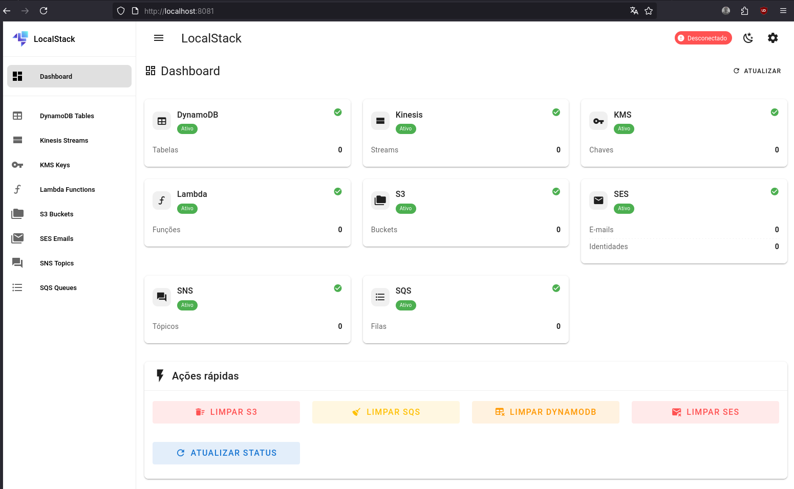
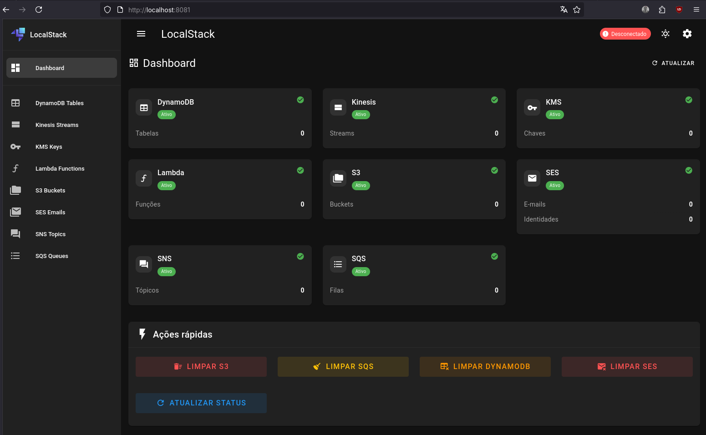

# Go API Template (Go + AWS Lambda + LocalStack Web + Serverless)

Template de API em Go com arquitetura limpa, pronto para:

- Desenvolvimento local com Docker Engine (docker compose)
- Simulação de AWS via LocalStack + LocalStack UI
- Lambda/API Gateway (handler HTTP) e binário local (servidor HTTP)
- Testes unitários nativos (sem frameworks de mock)
- Deploy com Serverless Framework (dev/test/prod)

## Estrutura de diretórios (baseada na Arquitetura Limpa de Bob Martin, aka 'Uncle Bob')

```text
.
├── cmd/
│   ├── main.go                 # Entrypoint HTTP local (binário)
│   └── lambda/main.go          # Entrypoint Lambda (AWS)
├── internal/
│   ├── adapter/
│   │   ├── httpserver/
│   │   │   ├── router.go       # Adaptador HTTP (delivery)
│   │   │   └── router_test.go  # Testes do adaptador
│   │   └── repository/
│   │       └── dynamo/
│   │           └── example_repository.go  # Repo CRUD usando a porta DynamoDB
│   ├── handler/
│   │   └── lambda.go           # Handler de API Gateway (Lambda) com logs estruturados
│   ├── port/
│   │   ├── dynamodb.go         # Port (interface) para DynamoDB
│   │   └── logger.go           # Port (interface) para Logger
│   └── usecase/
│       ├── health/
│       │   ├── service.go      # Caso de uso de healthcheck (injeta Logger/DynamoDB)
│       │   └── service_test.go
│       └── example/
│           └── service.go      # Caso de uso exemplo CRUD usando repo dynamo
├── pkg/
│   ├── dynamodb/
│   │   └── client.go           # Implementação AWS SDK v2 (DynamoDBPort)
│   └── logger/
│       └── zaplogger/
│           └── zaplogger.go    # Implementação com zap (Logger)
├── .setup/localstack-web/      # UI Web para LocalStack
├── Dockerfile
├── docker-compose.yml
├── Makefile
├── serverless.yml
├── events/
│   └── health-event.json
├── go.mod / go.sum
└── README.md
```

Decisão arquitetural

- Camada de domínios (usecase) depende apenas de ports (interfaces) em `internal/port`.
- Implementações de infraestrutura ficam em `pkg/*` (ex.: AWS SDK v2, zap), isoladas do domínio.
- Adapters expõem I/O (HTTP) e repositórios implementam orquestração para casos de uso.
- Composição e DI ocorrem nos entrypoints (`cmd/*`).

### Ports e pkg (exemplos)

- Logger (port): `internal/port/logger.go`
  - Implementação: `pkg/logger/zaplogger`
- DynamoDB (port): `internal/port/dynamodb.go`
  - Implementação: `pkg/dynamodb/client.go`
  - Repositório exemplo: `internal/adapter/repository/dynamo/example_repository.go`

### Injeção de dependências

- Entrypoint local (`cmd/main.go`):

```go
zl, _ := zaplogger.FromEnv()
ddbClient, _ := dynamodb.New(ctx, dynamodb.Options{Region: region, Endpoint: localstackEndpoint})
healthSvc := health.NewServiceWithDeps(localstackEndpoint, ddbClient, zl)
repo := dynamo.NewExampleRepository(ddbClient, "example-items")
exampleSvc := example.NewService(repo, zl)
router := httpserver.NewRouter(healthSvc, exampleSvc)
```

- Entrypoint Lambda (`cmd/lambda/main.go` + `internal/handler/lambda.go`):

```go
lambda.Start(handler.LambdaHandler) // o handler cria o logger e injeta no caso de uso
```

## Desenvolvimento local

1. Subir stack:

```bash
docker compose up -d --build
```

1. UI do LocalStack Web:

- <http://localhost:8081>

### Exemplos de Interface (LocalStack UI)

- #### Dashboard

   Modo **Light**


   Modo **Dark**


1. Healthcheck:

```bash
curl http://localhost:8080/health
```

1. CRUD de exemplo (/items)

- Crie a tabela no LocalStack (DynamoDB):
  - Nome: `example-items`
  - Partition key: `id (String)`

- Criar item:

```bash
curl -s -X POST http://localhost:8080/items \
  -H 'Content-Type: application/json' \
  -d '{"id":"1","name":"foo"}'
```

- Listar itens:

```bash
curl -s http://localhost:8080/items
```

- Obter item:

```bash
curl -s http://localhost:8080/items/1
```

- Atualizar:

```bash
curl -s -X PUT http://localhost:8080/items/1 \
  -H 'Content-Type: application/json' \
  -d '{"name":"bar"}'
```

- Deletar:

```bash
curl -s -X DELETE http://localhost:8080/items/1 -i
```

## Stack de exemplo (bootstrap LocalStack)

Ao subir o Docker (docker compose up -d --build), o LocalStack executa o script `localstack/01-bootstrap.sh` automaticamente (init/ready.d) e cria recursos para desenvolvimento:

- S3: bucket `s3://go-api-template-bucket`
- DynamoDB: tabela `example-items (PK: id String)`
- Lambda: função `health` (Go, runtime provided.al2)
- SNS: tópico `example-topic`
- SQS: fila `example-queue` assinada no tópico SNS

### Exemplos rápidos (awslocal)

- Verificar recursos criados:

```bash
awslocal s3 ls
awslocal dynamodb list-tables
awslocal lambda list-functions
awslocal sns list-topics
awslocal sqs list-queues
```

- Invocar a Lambda de exemplo:

```bash
awslocal lambda invoke \
  --function-name health \
  --payload '{"rawPath":"/health","requestContext":{"http":{"method":"GET","path":"/health"}}}' \
  /tmp/out.json >/dev/null && cat /tmp/out.json; echo
```

- Publicar no SNS e ler da SQS:

```bash
TOPIC_ARN=$(awslocal sns list-topics --query 'Topics[0].TopicArn' --output text)
awslocal sns publish --topic-arn "$TOPIC_ARN" --message 'hello from sns'
QUEUE_URL=$(awslocal sqs get-queue-url --queue-name example-queue --query QueueUrl --output text)
awslocal sqs receive-message --queue-url "$QUEUE_URL" --wait-time-seconds 1
```

- S3: enviar e listar arquivo:

```bash
awslocal s3 cp README.md s3://go-api-template-bucket/README.md
awslocal s3 ls s3://go-api-template-bucket
```

- DynamoDB: inserir e listar itens:

```bash
awslocal dynamodb put-item \
  --table-name example-items \
  --item '{"id":{"S":"test-1"},"name":{"S":"foo"}}'
awslocal dynamodb scan --table-name example-items
```

## Testes

```bash
go test ./...
```

## Build e empacote Lambda (custom runtime provided.al2)

```bash
make package-lambda
```

Isso gera `.serverless/health.zip` contendo o binário `bootstrap` (exigência do runtime).

## Deploy com Serverless

- Pré-requisitos: Node 18+, npm/npx.
- Com LocalStack (desenvolvimento):

```bash
REGION=us-east-1 make sls-deploy
```

- Remover:

```bash
REGION=us-east-1 make sls-remove
```

- Para AWS real, autentique sua AWS CLI/credenciais e rode o mesmo comando, sem LocalStack em execução.

## Variáveis

- LOCALSTACK_ENDPOINT: container (<http://localstack:4566>), host (<http://localhost:4566>)
- AWS_REGION: us-east-1 (default)
- APP_ENV: dev/local/prod (define preset do logger)
- ENABLE_DYNAMODB: false para desabilitar cliente (default habilitado)
- EXAMPLE_TABLE: nome da tabela para o CRUD (default: example-items)

## Licença

MIT
